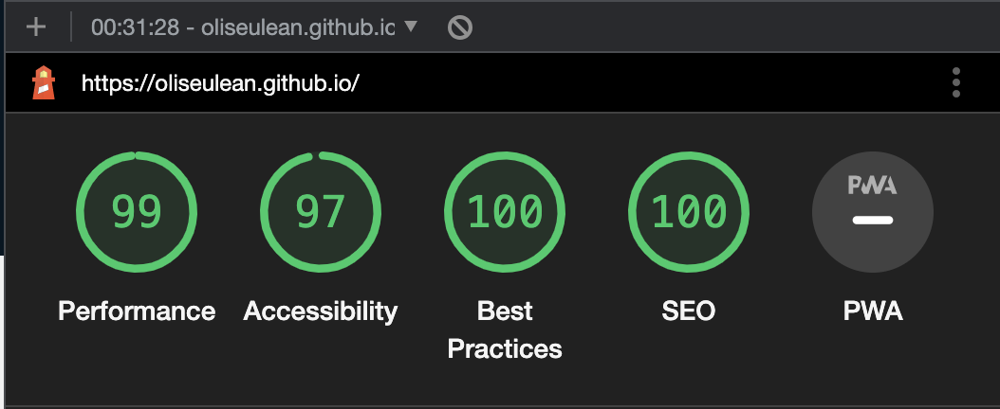

# Olimpiu Seulean Portfolio

Personal website portfolio.

## Lighthouse report

 <figure>
 
 <figcaption>
 

 </figcaption>
</figure>

## Running Locally

1. Run yarn to install packages: <strong>`yarn`</strong>.
2. Run Vite dev server: <strong>`yarn dev`.</strong> Server will run at http://localhost:5000.
3. Build js and css for release: <strong>`yarn build`.</strong>
4. After you run <strong>`yarn build`</strong> and your assets were created, you can run: <strong>`yarn preview`</strong>, to locally preview production build.

## Frameworks/Tools

<strong>Vite</strong> (build tool): https://vitejs.dev/  
<strong>Vue 3</strong> (front-end framework) https://vuejs.org/  
<strong>Routing</strong> (routes): https://vuejs.org/guide/scaling-up/routing.html  
<strong>Yarn</strong> (package manager): https://yarnpkg.com/  

## Yarn

This project also use [yarn](https://yarnpkg.com/en) as the package maanger, this is a necessarry install (along with NodeJS) before the project can be installed/run locally.

### Lint

I use eslint and stylelint to enforce Vue templates coding standards. These will run and check your code on commit of your changes. You will not be able to commit until all errors are corrected.

## Application Structure

- /dist - build files created by Vite when running `yarn build`.
- /public - public files likes images and logo.
- /src - All client-side JS files for rendering the UI of the application.
